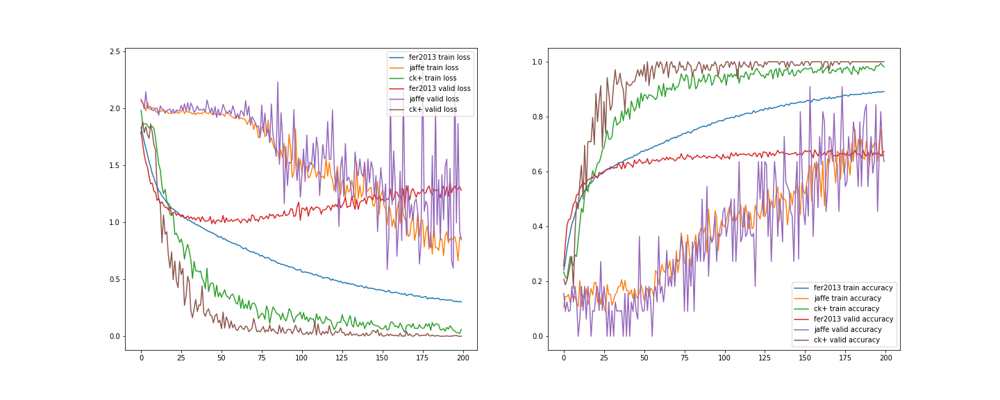
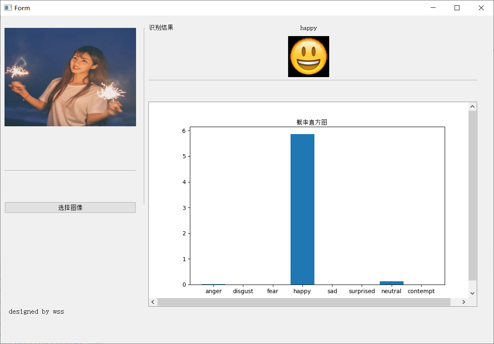
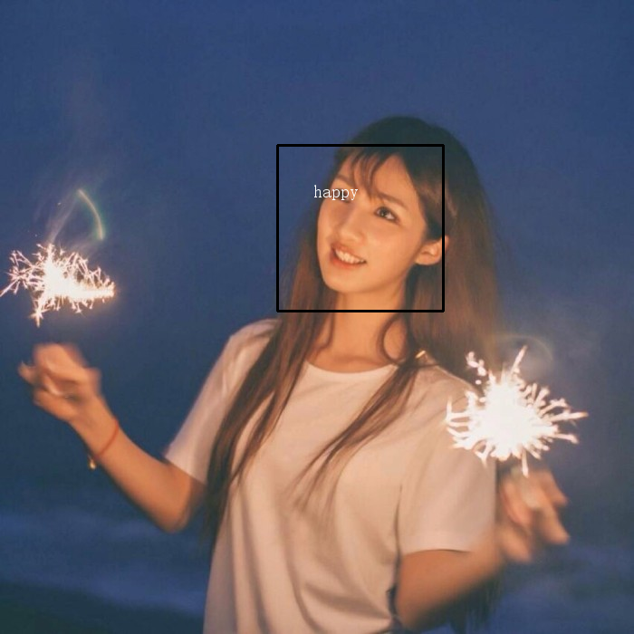

# 人脸表情识别


> 2020.8.22，重构了整个仓库代码，改用Tensorflow2中的keras api实现整个系统。考虑到很多反映jupyter notebook写的train使用起来不太方便，这里改成了py脚本实现。


## 简介
使用卷积神经网络构建整个系统，在尝试了Gabor、LBP等传统人脸特征提取方式基础上，深度模型效果显著。在FER2013、JAFFE和CK+三个表情识别数据集上进行模型评估。


## 环境部署
基于Python3和Keras2（TensorFlow后端），具体依赖安装如下(推荐使用conda虚拟环境)。
```shell script
git clone https://github.com/luanshiyinyang/FacialExpressionRecognition.git
cd FacialExpressionRecognition
conda create -n FER python=3.6
source activate FER
conda install cudatoolkit=10.1
conda install cudnn=7.6.5
pip install -r requirements.txt
```
如果你是Linux用户，直接执行根目录下的`env.sh`即可一键配置环境，执行命令为`bash env.sh`。


## 数据准备
数据集和预训练模型均已经上传到百度网盘，[链接](https://pan.baidu.com/s/1LFu52XTMBdsTSQjMIPYWnw)给出，提取密码为2pmd。下载后将`data.zip`移动到根目录下的`dataset`文件夹下并解压得到一个`*.h5`的模型参数文件，将`model.zip`移动到根目录下的`models`文件夹下并解压得到包含多个数据集压缩文件，均解压即可得到包含图像的数据集（**其中rar后缀的为原始jaffe数据集，这里建议使用我处理好的**）。


## 项目说明
### **传统方法**
- 数据预处理
	- 图片降噪
	- 人脸检测（HAAR分类器检测（opencv））
- 特征工程
	- 人脸特征提取
		- LBP
		- Gabor
- 分类器
	- SVM
### **深度方法**
- 人脸检测
	- HAAR分类器
	- MTCNN（效果更好）
- 卷积神经网络
  - 用于特征提取+分类


## 网络设计
使用经典的卷积神经网络，模型的构建主要参考2018年CVPR几篇论文以及谷歌的Going Deeper设计如下网络结构，输入层后加入(1,1)卷积层增加非线性表示且模型层次较浅，参数较少（大量参数集中在全连接层）。
<div align="center"></div>
<div align="center"></div>


## 模型训练
主要在FER2013、JAFFE、CK+上进行训练，JAFFE给出的是半身图因此做了人脸检测。最后在FER2013上Pub Test和Pri Test均达到67%左右准确率（该数据集爬虫采集存在标签错误、水印、动画图片等问题），JAFFE和CK+5折交叉验证均达到99%左右准确率（这两个数据集为实验室采集，较为准确标准）。

执行下面的命令将在指定的数据集（fer2013或jaffe或ck+）上按照指定的batch_size训练指定的轮次。训练会生成对应的可视化训练过程，下图为在三个数据集上训练过程的共同绘图。

```shell
python src/train.py --dataset fer2013 --epochs 300 --batch_size 32
```



## 模型应用
与传统方法相比，卷积神经网络表现更好，使用该模型构建识别系统，提供**GUI界面和摄像头实时检测**（摄像必须保证补光足够）。预测时对一张图片进行水平翻转、偏转15度、平移等增广得到多个概率分布，将这些概率分布加权求和得到最后的概率分布，此时概率最大的作为标签（也就是使用了推理数据增强）。

### **GUI界面**

注意，**GUI界面预测只显示最可能是人脸的那个脸表情，但是对所有检测到的人脸都会框定预测结果并在图片上标记，标记后的图片在output目录下。**

执行下面的命令即可打开GUI程序，该程序依赖PyQT设计，在一个测试图片（来源于网络）上进行测试效果如下图。

```shell
python src/gui.py
```


上图的GUI反馈的同时，会对图片上每个人脸进行检测并表情识别，处理后如下图。



### **实时检测**
实时检测基于Opencv进行设计，旨在用摄像头对实时视频流进行预测，同时考虑到有些人的反馈，当没有摄像头想通过视频进行测试则修改命令行参数即可。

使用下面的命令会打开摄像头进行实时检测（ESC键退出），若要指定视频进行进行检测，则使用下面的第二个命令。
```shell
python src/recognition_camera.py
```

```shell
python src/recognition_camera.py --source 1 --video_path 视频绝对路径或者相对于该项目的根目录的相对路径
```

下图是动态演示的在Youtube上[某个视频](https://www.youtube.com/watch?v=r5Z741PC9_c)上的识别结果。

